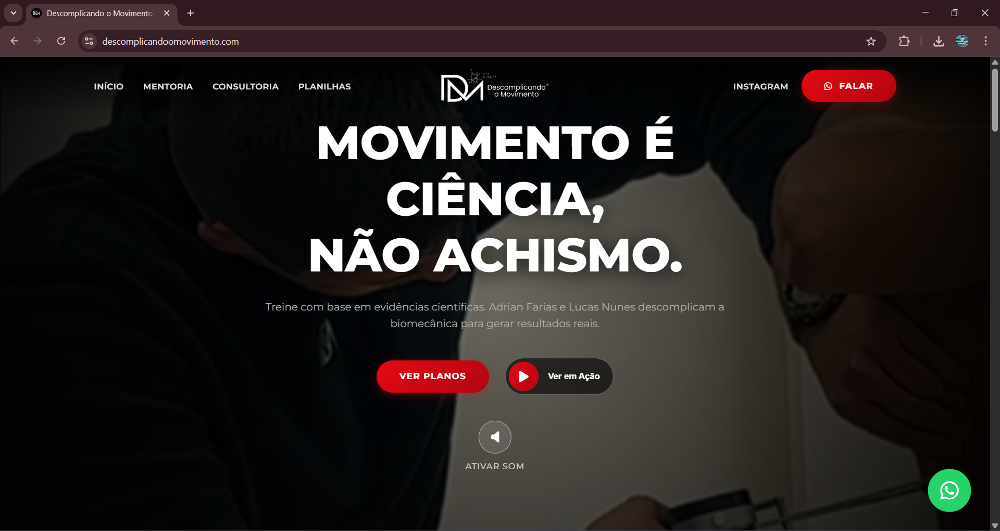

# Descomplicando o Movimento



> Movimento é ciência, não achismo. Treine com base em evidências científicas e biomecânica com Adrian Farias e Lucas Nunes.

## 📝 Descrição do Projeto

O **Descomplicando o Movimento** é a landing page oficial e plataforma de serviços de consultoria e mentoria esportiva de Adrian Farias e Lucas Nunes. O objetivo do projeto é apresentar a metodologia dos profissionais, exibir resultados de alunos e oferecer caminhos fáceis para captação de clientes interessados em planilhas de treino e consultoria 100% individualizada.

## ✨ Funcionalidades

- **Apresentação de Serviços:** Seções detalhadas sobre Consultoria e Mentoria.
- **Galeria de Resultados:** Exposição de transformações e depoimentos em formato de carrossel.
- **Formulário de Triagem Avançado:** Captação de leads de forma interativa para melhor entendimento do aluno.
- **Venda de Planilhas:** Página focada na conversão com integração direta para pagamento/contato via WhatsApp.
- **Modais Nativos e Vídeos Inteligentes:** Videos com lazy-loading adaptativo, modais imersivos para depoimentos e triagem.
- **Acessibilidade & SEO Avançado:** Marcação estruturada (Schema.org) e interface acessível.

## 🚀 Stack Tecnológica

O projeto foi construído propositalmente sem a utilização de frameworks front-end pesados (como React, Angular ou Vue), apostando na velocidade, controle absoluto do DOM e otimização cirúrgica que apenas o desenvolvimento "Vanilla" pode oferecer.

### 🌐 Estrutura e Marcação
- **HTML5 Semântico:** Utilização rigorosa de tags semânticas (`<header>`, `<main>`, `<section>`, `<nav>`) para facilitar o entendimento dos robôs de busca (SEO) e tecnologias assistivas (leitores de tela).
- **Acessibilidade (WCAG):** Emprego de tags `alt` dinâmicas e `aria-labels` em ícones e botões interativos para garantir que todos os usuários possam navegar de forma eficiente.
- **Microdados e SEO Avançado:** Incorporação de **JSON-LD Schema.org** (classificando o negócio e os serviços) e tags nativas como **Open Graph** (Facebook/LinkedIn) e **Twitter Cards**.

### 🎨 Estilização e Design System
- **CSS3 Vanilla & Variáveis CSS (`:root`):** Criação de um mini-design system nativo gerenciando cores, transições e tipografia via escopo global, facilitando manutenção e escalabilidade.
- **Glassmorphism & Gradientes:** Utilização avançada de `backdrop-filter: blur()`, sombras multicamadas (box-shadow) e gradientes radiais para transmitir uma sensação premium.
- **CSS Flexbox e CSS Grid:** Utilizados em conjunto para construir layouts unidimensionais (barras de navegação) e bidimensionais (grades de perfis e serviços), garantindo o design fluido.
- **Responsividade (Mobile First & Clamp):** Uso extensivo da função `clamp()` do CSS para escalonamento fluido de tipografia (Fluid Typography) sem depender estritamente de dezenas de media queries.

### ⚙️ Lógica e Interatividade
- **JavaScript (ES6+) Vanilla:** Todo o controle de eventos e estado (como modais, menus mobile, e slides) foi escrito em JavaScript puro, sem dependência de jQuery ou plugins de terceiros.
- **Intersection Observer API:** Empregado de forma inteligente para monitorar o scroll da tela e acionar:
  1. **Animações de entrada (Scroll Reveal):** Elementos surgem suavemente na tela (`transform`, `opacity`).
  2. **Lazy Loading e Play de Vídeo Inteligente:** Vídeos em background (elementos muito pesados) só sofrem `play()` e carregam controles reais quando entram de fato na área visível do navegador do usuário, economizando bateria e consumo de dados da rede móvel.
- **Lógica de Carrossel Proprietária:** Carrossel de depoimentos gerido por arrays e temporizadores nativos (`setInterval`) garantindo baixo consumo de CPU no dispositivo do cliente.

### 🧰 Ferramentas Auxiliares e Assets
- **FontAwesome (CDN):** Fornecimento da iconografia vetorial do site.
- **Google Fonts:** Importação assíncrona da fonte primária (Montserrat).
- **Otimização de Assets:** Técnicas de `loading="lazy"` implementadas programaticamente.

## 🛠️ Instalação

Como o projeto é estático (HTML/CSS/JS puros), não é necessária nenhuma build complexa para rodar localmente.

1. **Clone o repositório:**
   ```bash
   git clone https://github.com/Jonhycristian/descomplicando-o-movimento.git
   ```
2. **Navegue até a pasta do projeto:**
   ```bash
   cd descomplicando-o-movimento
   ```
3. **Execute:**
   Basta abrir o arquivo `index.html` em seu navegador favorito ou utilizar o Live Server (extensão do VS Code).

## 📂 Estrutura do Projeto

```text
├── index.html           # Página principal (Home)
├── consultoria.html     # Landing page de Consultoria
├── mentoria.html        # Landing page de Mentoria
├── Planilhas.html       # Página de Venda de Planilhas
├── style.css            # Folha de estilos unificada
├── script.js            # Lógicas de UI, carrossel, vídeo e menu
└── assets/              # Diretório contendo imagens (logo, perfis, resultados) e vídeos
```

## 🛡️ Segurança

- Tratando-se de uma aplicação "cliente-side" (estática), a exposição de vulnerabilidades é mínima.
- Os contatos são direcionados de forma segura e direta via link de WhatsApp.

## 👨‍💻 Autor

- **Desenvolvido por:** Adrian Farias e Lucas Nunes (e time de dev).
- **Links:** [Instagram](https://www.instagram.com/descomplicando_omovimento)

## 📄 Licença

Este projeto está sob a licença **MIT License**. Veja o arquivo [LICENSE](LICENSE) para mais detalhes.
